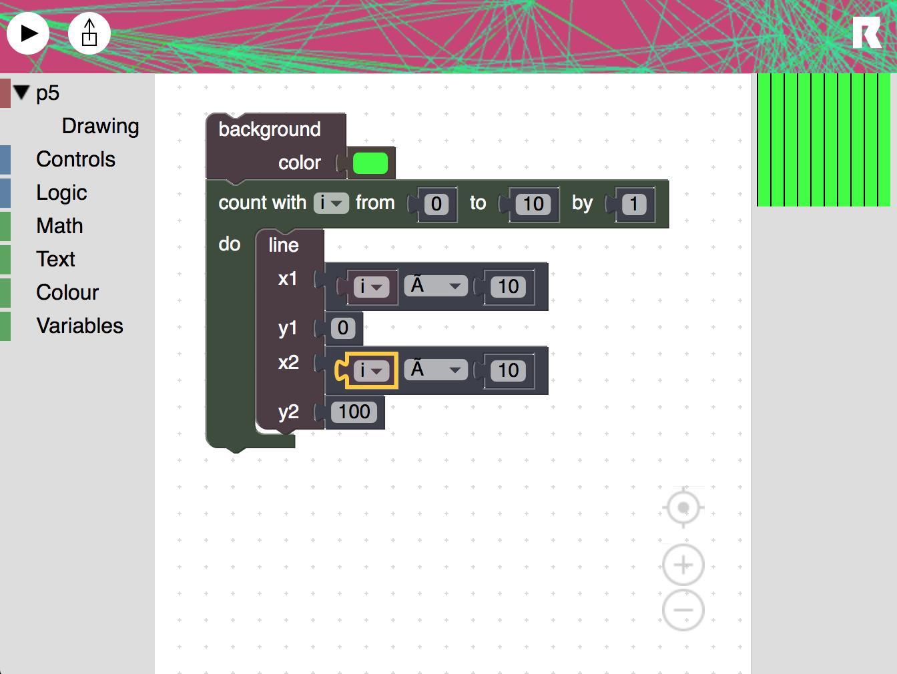

# Rigglin

How easy and fun can we make learning to program for artists?

Rigglin is a bridge between p5js and Blockly. It implements a language
binding to the actual p5js engine.

Rigglin is a Blockly-leaning Processing, which means it's not an attempt
at bringing reduntant stuff over from Processing. Since Blockly
already has a color system, we will use that instead. Precise color
control can also be provided through additional implementation, but
both should be available. One for ease of use, and one for advanced
control.

Take basic tutorial at https://medium.com/@jtnimoy/introducing-rigglin-b849eca30cb6

## Installing
visit http://rigglin.appspot.com
or launch `index.html` in a browser

---

## Compiling:
	cd to blockly/ and run `gulp`
	copy to static:
		/msg
		/media
		/demo
		/*_compressed.js
	
## Developing:
	cd into blockly/appengine
	run `gcloud app deploy`

## Adding New Blocks

The following is for adding a new global function. I don't yet know how to add global variables like `width`, and I don't know how to do custom types like `PFont` or `PVector`

edit /blockly/blocks/p5.js and add a new entry for the block.

edit /blockly/generators/javascript/p5.js and add new JS code that generates more JS code.

edit /blockly/appengine/static/index.html and add the new block into the toolbar.

compile with `make build-regular`

deploy to App Engine with `make deploy`
