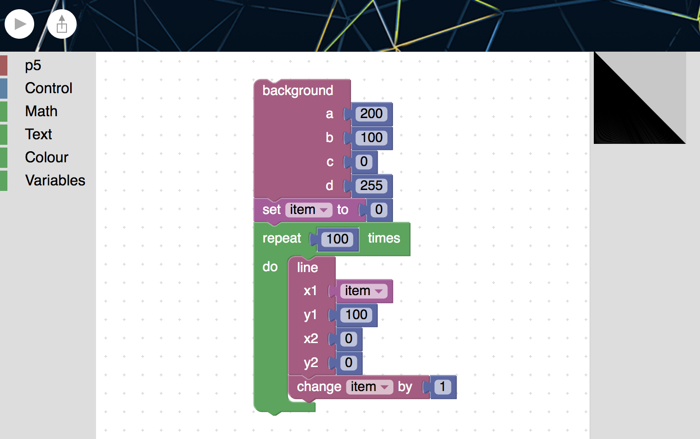

# Rigglin

Riggin is a bridge between p5js and Blockly. It implements a language binding to the actual p5js engine.

instructions for installing:
launch `index.html` in a browser
or visit http://rigglin.appspot.com

## compiling:
	cd to blockly/ and run `gulp`
	
## developing:
	cd into blockly/appengine
	run `gcloud app deploy`

## adding new blocks
	

milestones:
+ wk 1 sucessful compile from repo
+ wk 1 integration of p5js
+ wk 1 adding functions
+ wk 1 tackled variable resolution bug
+ wk 2 public to cloud for storage
+ wk 2 style html layout
